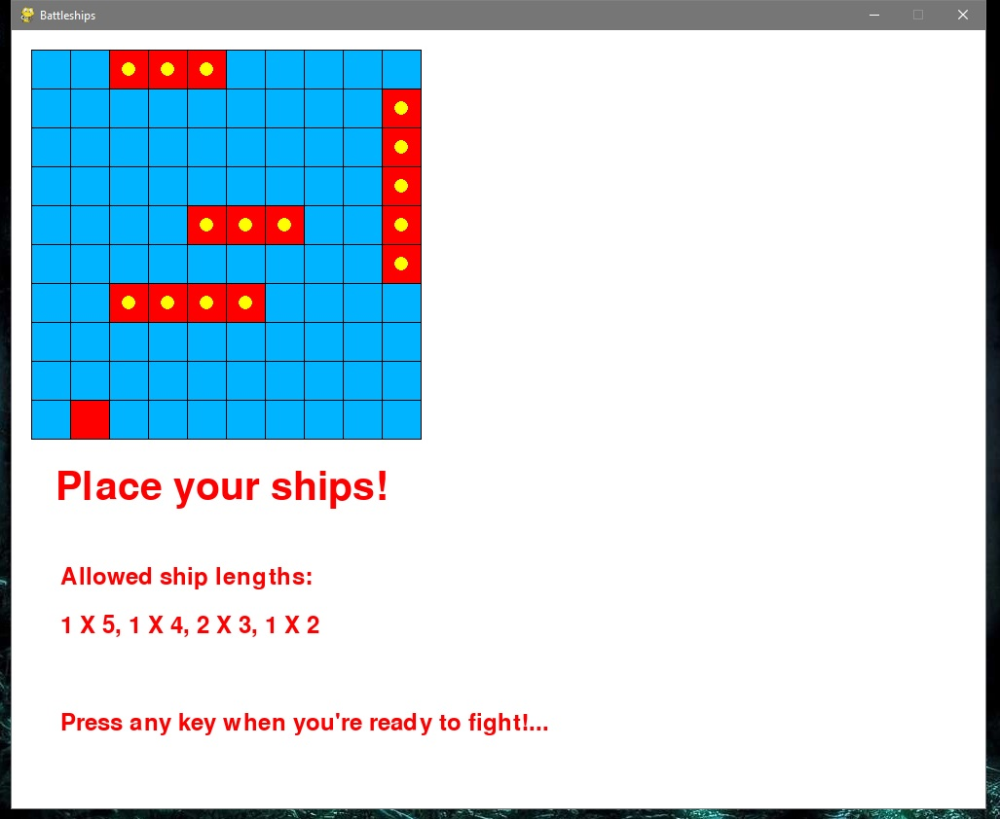
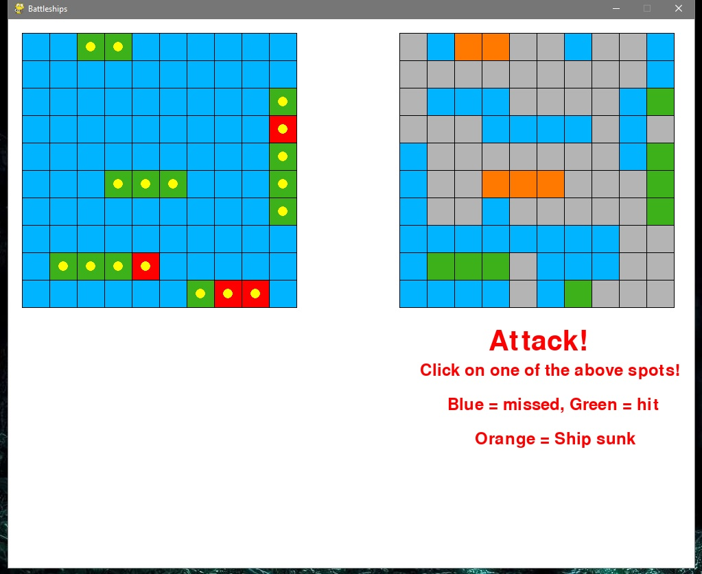

# Battleships
Battleships Game written in python! Module "pygame" used for the GUI

Game 99% finished
(rare bugs(edge cases) may happen) 

Currently supports only one player(playing against himself)...

Future plans:
  - program AI
  - add sockets for two player-mode to play over a LAN or the Internet

